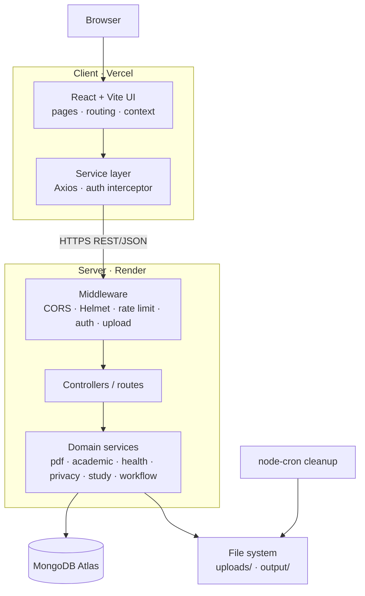
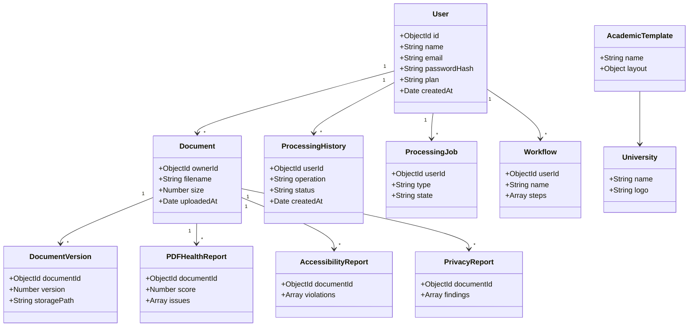
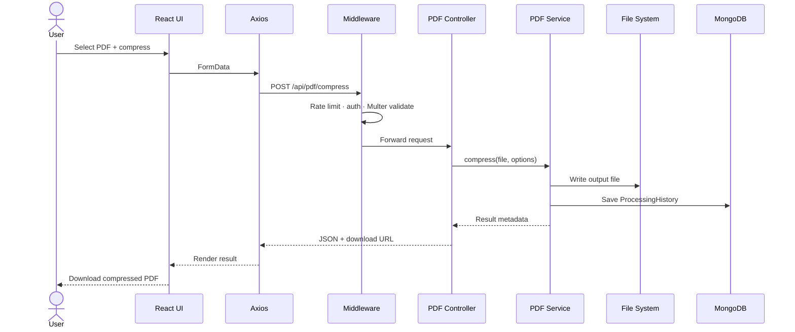
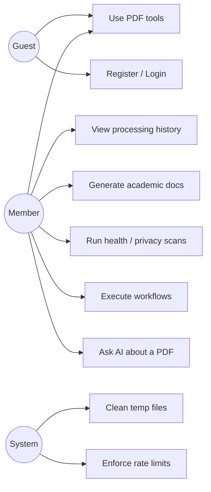

# PDFnerd

> All-in-one PDF workspace — everyday PDF tools plus specialized workspaces for academic documents, PDF health, accessibility, privacy, study mode, AI assistance, and one-click workflows.

**Live:** [pdf-nerd.vercel.app](https://pdf-nerd.vercel.app/) · **API:** [pdfnerd.onrender.com/api](https://pdfnerd.onrender.com/api) · **License:** MIT

---

## Stack

| Layer | Technology |
|---|---|
| Frontend | React 19, Vite, React Router, Tailwind, Axios, Framer Motion |
| Backend | Node.js, Express, Mongoose, JWT, Multer, pdf-lib, Sharp |
| Security | Helmet, CORS, express-rate-limit, express-validator, bcryptjs |
| Database | MongoDB Atlas (`pdfinity`) |
| Hosting | Vercel (client) · Render (server) |

---

## Features

**PDF tools** — merge, split, compress, rotate, watermark, protect, unlock, delete pages, extract pages, page numbers, JPG→PDF, processing history.

**Workspaces**

| Workspace | Purpose |
|---|---|
| Academic Studio | Cover pages, templates, university data, document building |
| PDF Health & Doctor | Health analysis, repair, reports |
| Accessibility | Compliance audits and reports |
| Privacy & Security | Metadata scanning and sanitization |
| Exam & Study Mode | Study material generation, PDF Q&A |
| AI Assistant | AI-assisted document workflows |
| One-Click Workflows | Reusable multi-step automation presets |

**Platform** — registration, login, password reset, JWT sessions, dashboard, pricing, tool discovery.

---

## UML — Component Diagram



---

## UML — Class Diagram (Data Model)



---

## UML — Sequence Diagram (PDF Compression)



---

## UML — Use Case Diagram



---

## API Reference

```http
GET  /api/health

POST /api/auth/register
POST /api/auth/login
GET  /api/auth/me
POST /api/auth/forgot-password
POST /api/auth/reset-password/:token

POST /api/pdf/merge | split | compress | rotate | delete-pages
POST /api/pdf/extract-pages | watermark | page-numbers
POST /api/pdf/protect | unlock | jpg-to-pdf
GET  /api/pdf/history
DEL  /api/pdf/history/:id
GET  /api/pdf/download/:filename

GET  /api/academic/templates | universities
POST /api/academic/generate-cover | build-document

POST /api/health-check/analyze | doctor-heal
POST /api/accessibility/audit
POST /api/privacy/scan | sanitize
POST /api/study/generate | ask
GET  /api/workflows/presets
POST /api/workflows/execute
```

---

## Project Structure

```text
PDFnerd/
├── client/src/
│   ├── components/   # common · home · layout · tool · ui
│   ├── context/      # AuthContext · WorkspaceContext
│   ├── data/         # templates · tools · universities · workflows
│   ├── pages/        # academic · accessibility · ai · auth · health ·
│   │                 # privacy · study · tool · workflows · workspace
│   ├── services/     # api.js · authService.js · pdfService.js
│   └── utils/
└── server/
    ├── config/       # db.js · constants.js
    ├── controllers/  # authController · pdfController
    ├── middleware/   # auth · errorHandler · rateLimiter · upload
    ├── models/       # 11 Mongoose models
    ├── routes/       # 8 domain route files
    ├── services/     # 8 domain service files
    └── utils/        # fileCleanup · statsTracker · validators
```

---

## Local Setup

Requires **Node.js 20+**, npm, and a MongoDB Atlas connection string.

```bash
git clone https://github.com/Sajjadhossain693/PDFnerd.git
cd PDFnerd

# Backend
cd server && npm install
cp .env.example .env     # fill in values
npm start                # http://localhost:5000

# Frontend (new terminal)
cd client && npm install
npm run dev              # http://localhost:5173
```

Vite proxies `/api` to `http://localhost:5000`. Verify the backend at `/api/health`.

---

## Environment Variables

**`server/.env`**

```env
PORT=5000
NODE_ENV=development
MONGODB_URI=mongodb+srv://<user>:<pass>@<cluster>/pdfinity
JWT_SECRET=replace_with_a_long_random_secret
JWT_EXPIRE=7d
CLIENT_URL=http://localhost:5173
MAX_FILE_SIZE_FREE=10485760
MAX_FILE_SIZE_PREMIUM=104857600
MAX_FILES_FREE=5
MAX_FILES_PREMIUM=50
TEMP_FILE_TTL_MINUTES=60
```

**`client/.env`**

```env
VITE_API_URL=https://pdfnerd.onrender.com/api
```

Anything prefixed `VITE_` is exposed to the browser — never put secrets there.

---

## Deployment

| Service | Setting |
|---|---|
| **Vercel** | Preset `Vite` · Root `client` · Build `npm run build` · Output `dist` |
| **Render** | Root `server` · Build `npm install` · Start `npm start` |
| **Atlas** | Database `pdfinity`, network access allowing the Render service |

Set `CLIENT_URL` on Render to the exact Vercel origin (no trailing slash) or CORS will reject requests.

---

## Troubleshooting

| Issue | Fix |
|---|---|
| `Cannot find module` | Dependency is in the wrong `package.json` — reinstall in `server/` or `client/` |
| MongoDB `ENOTFOUND` | Check hostname, credentials, URL-encoded password, and Atlas network access |
| CORS error | `CLIENT_URL` must match the frontend origin exactly |
| Frontend can't reach API | `VITE_API_URL` must include the `/api` suffix |
| Vercel serving old code | Confirm latest commit deployed, root dir is `client`, output is `dist` |
| Render missing deps | Root Directory must be `server`, not the repo root |
| Works on mobile, not desktop | Check `z-index`, `pointer-events`, overlays, and 3D transforms on `Tilt3DCard` |

---

## Production Rules

- Never commit `.env`, secrets, or `node_modules/`.
- Never commit generated uploads, output files, or `client/dist/`.
- Let Vercel build from source; treat runtime directories as temporary.

---

## Roadmap

- **Editor** — visual editing, annotation, signatures, form filling
- **AI** — summarization, OCR, citation-aware answers, multi-document chat
- **Processing** — job queue, progress tracking, batch mode, cloud storage
- **Security** — refresh-token rotation, audit logging, malware scanning
- **Infra** — Redis rate limiting, monitoring, automated tests, CI/CD

---

MIT Licensed · [github.com/Sajjadhossain693/PDFnerd](https://github.com/Sajjadhossain693/PDFnerd)
